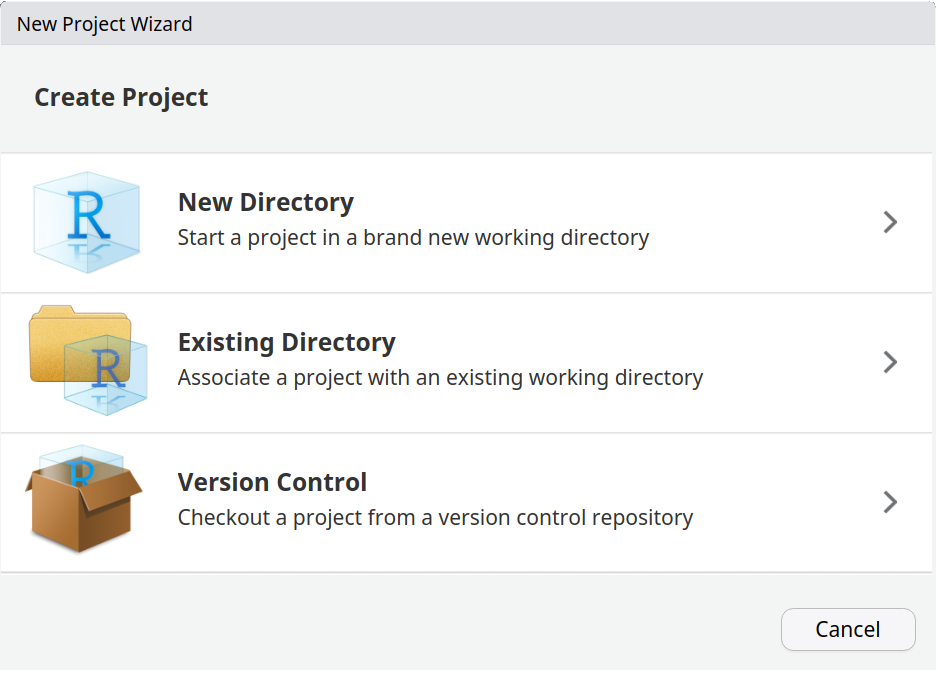
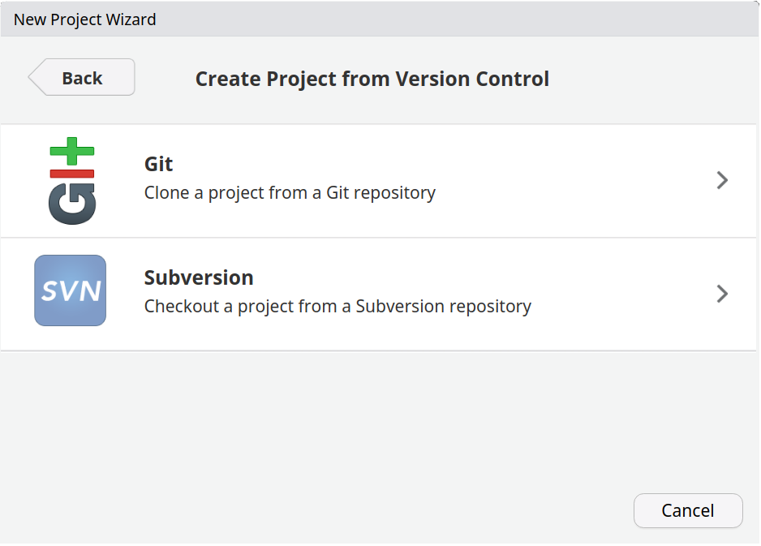
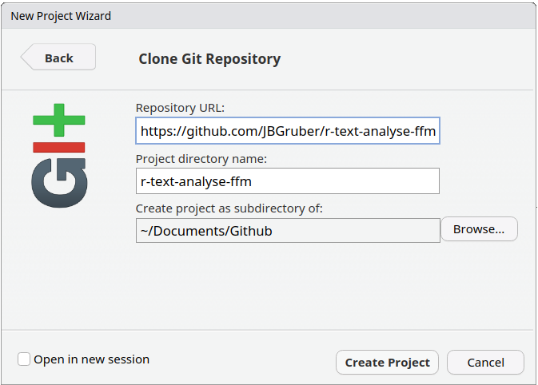

# Workshop Automated Content Analysis

# Schedule

| Time        | Day 1                              | Day 2                        |
|:------------|:-----------------------------------|:-----------------------------|
| 09:00-10:30 | Obtaining Text Data                | Word Embeddings              |
| 11:00:12:30 | Text Scaling and Regression Models | Deep Learning                |
| 14:00-15:30 | Supervised Classification Methods  | Big Data Projects: Some Tips |

# More information

See the [Syllabus](0_Syllabus.pdf) with some info and recommended
reading.

# Preparation before the course

## Prerequisites

I assume that you have [R]() and [RStudio]() installed and have some
basic knowledge of R. If that is not the case, you can also use this
workshop to get an overview of available approaches. But you will have a
harder time following what’s going on in the sessions.

## Download the project

I use GitHub to distribute the course material, but you don’t really
have to know much about the platform. It’s just where I do most of my
work. To download the material, you can use RStudio directly or use
another version of git, if you alreay know what you are doing. In
RStudio go to “Create a project” (top left corner with this symbol
). Then select “Version Control”:



In the next window, select “Git”:



Then copy the URL
`https://github.com/JBGruber/r-text-analyse-vienna.git` into the URL
field and select where to download the project to.



After clicking “Create Project”, a new session should open. That’s it!

## Install R packages

The short code below will check the tutorial files for mentioned R
packages and install the missing ones on your computer:

``` r
if (!requireNamespace("rlang", quietly = TRUE)) install.packages("rlang", dependencies = TRUE)
rlang::check_installed("attachment")
if (!rlang::is_installed("quanteda.corpora")) remotes::install_github("quanteda/quanteda.corpora")
if (!rlang::is_installed("paperboy")) remotes::install_github("JBGruber/paperboy")
if (!rlang::is_installed("mediacloud")) remotes::install_github("joon-e/mediacloud")
rlang::check_installed(attachment::att_from_qmds(list.files(pattern = ".qmd")))
```

## Update packages

You should update the R packages installed on your computer:

``` r
update.packages(ask = FALSE, Ncpus = 4L)
```

This uses 4 cores, you could also use more/less depending on your
system.

## Python stuff?

In Session 6, we will use some Python to run deep learning transformer
models that are not available in R (we will still use R to control
Python though). In my experience, it is hard for people to set this up
and on computers without dedicated graphics cards it also does not make
a lot of sense. So I made the decision to move this part to the cloud.
You can still try to follow the explanation in the document before the
session, but we will not have time to troubleshoot problems in class.
